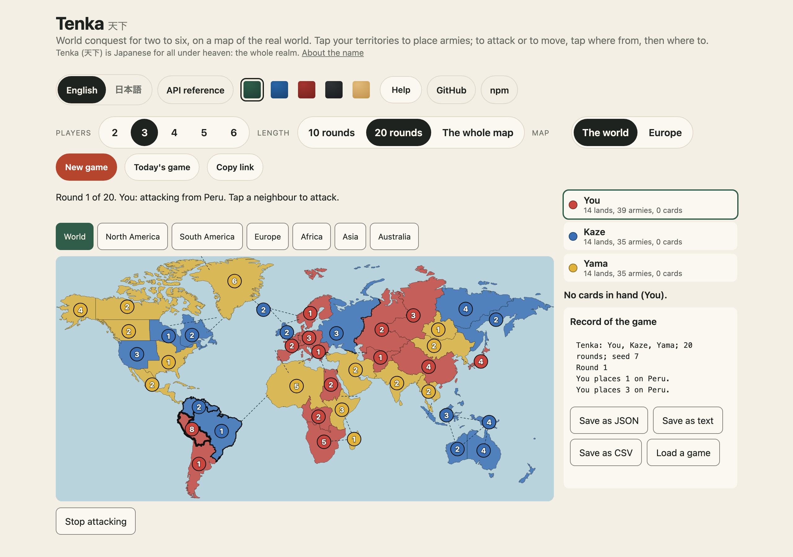
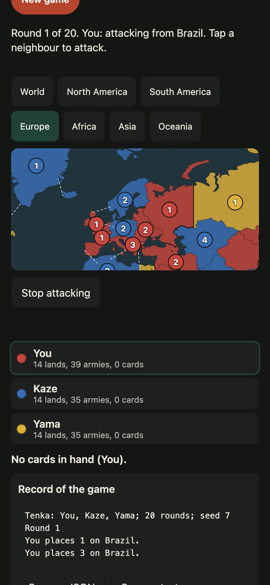

# Tenka 天下

[](https://github.com/johnmorrisdotca/tenka/actions/workflows/ci.yml)
[](https://www.npmjs.com/package/@johnmorrisdotca/tenka)
[](LICENSE)


**World conquest for two to six, on a map of the real world, as pure and seeded TypeScript.**

The classic world-conquest game for two to six players, on a map of the modern
world: place your armies, attack your neighbours with the dice, trade in sets of
cards for more armies, and take the world, or hold the most of it when the last
round is counted.

*Tenka* (天下, "under heaven") is the realm, as in *tenka-tori*, the taking of
it that Japan's warlords set out to do in the sixteenth century.

**[Play it](https://johnmorrisdotca.github.io/tenka/)**

<p>
  
  
</p>

- **The rules as plain functions.** A game is a value: `startTenka` deals one,
  `playTenka` makes a move and returns the next game, or `null` for a move the
  rules refuse. Nothing is changed in place.
- **Seeded.** Every shuffle, deal and die is drawn from the game's own seeded
  random, so a game replays exactly from its seed and its moves. A whole game is
  kept as a few kilobytes of text (`encodeTenka`, `decodeTenka`).
- **A computer player.** `sensibleTenkaMove` trades when it can, piles armies on
  a border, attacks only with the odds and fortifies to the front.
- **Every move listed.** `tenkaMoves(game)` lists what the player to move may
  do, for your own computer player or tests.
- **A map of the real world.** Forty-two territories in six continents, drawn
  from Natural Earth, with their neighbours by land and by sea.
- **A table to play on.** `mountTenka` draws and plays a whole game in plain
  DOM, against the computer or by people taking turns on one device. `TenkaMap`
  is the map as a React component.
- **No dependencies.** It runs anywhere, including a static page on GitHub
  Pages.

It is the Tenka on [Itsutsu](https://itsutsu.com/games/tenka), which plays its
tables round one device and across several with this package.

## Install

```sh
pnpm add @johnmorrisdotca/tenka   # or: npm install @johnmorrisdotca/tenka
```

Or straight from a GitHub release, pinned to its version:

```sh
pnpm add https://github.com/johnmorrisdotca/tenka/releases/download/v1.0.0/johnmorrisdotca-tenka-1.0.0.tgz
```

ES modules with types. The rules have no dependencies; the React component needs
React 18 or later.

## Play a game in code

```ts
import { playTenka, sensibleTenkaMove, startTenka, tenkaMoves, tenkaOver } from "@johnmorrisdotca/tenka";

let game = startTenka(20, ["Ann", "Ben", "Cho"], 2026)!; // 20 rounds, three players, seed 2026

while (!tenkaOver(game)) {
  const move = sensibleTenkaMove(game, Math.random); // or pick from tenkaMoves(game)
  game = playTenka(game, move)!;
}

console.log(game.winners); // seats that won: [1]
```

`startTenka(rounds, players, seed, placing?)` takes the rounds before the count
(10, 20, or 60 for the whole world, `TENKA_LENGTHS`), two to six names, a seed,
and whether the starting armies are placed at random (`"auto"`, the default) or
one at a time by the players (`"hand"`).

### The game

A `TenkaGame` holds everything: `owners` and `armies` per territory, `hands` of
cards per seat, `toPlay`, `phase`, `round`, the `reserve` of armies to place,
the `lastRoll` of the dice, who is `out`, and on a finished game the `winners`.
Territories are numbers, their place in `TENKA_TERRITORIES`; the neutral army
that holds a third of the world in a game for two is `TENKA_NEUTRAL` (`-1`).

### Moves

| Move | When |
| --- | --- |
| `{ kind: "place", territory, armies }` | reinforcing: one army, or all still waiting |
| `{ kind: "trade", cards }` | reinforcing: three cards that make a set (`setsIn(hand)`) |
| `{ kind: "attack", from, to, dice }` | attacking: one throw, one to three dice |
| `{ kind: "blitz", from, to }` | attacking: throw until it is decided |
| `{ kind: "occupy", armies }` | after taking a territory: how many move in |
| `{ kind: "endAttack" }` | stop attacking and fortify |
| `{ kind: "fortify", from, to }` then `{ kind: "shift", armies }` | one move between joined territories, ending the turn |
| `{ kind: "endTurn" }` | fortifying: end the turn without moving |

### The rules it plays

The standard numbers, which no one owns: 40, 35, 30, 25 or 20 starting armies
for two to six players; a turn brings one army for every three territories held,
three at least, plus each continent's bonus; the attacker throws up to three
dice and the defender up to two, highest against highest, ties to the defender;
a territory taken earns a card at the end of the turn; sets are worth 4, 6, 8,
10, 12, 15 and five more each time after, with two armies more on a territory
the set shows that you hold; five cards in hand must be traded. A game ends when
one player holds the world, or at the end of its last round, when the most
territories wins (most armies breaking a tie).

### Taps on a map

`tapTerritory(game, choice, territory)` says what a press on a territory means
now, and returns the next choice and the move to make, if any. `marksFor(game,
choice)` says what to light up. That is all a board needs to be played by touch.

### Keeping a game

```ts
import { decodeTenka, encodeTenka } from "@johnmorrisdotca/tenka";

localStorage.setItem("tenka", encodeTenka(game));
const again = decodeTenka(localStorage.getItem("tenka")); // null for anything that is not a game these rules can replay
```

`writeTenkaMove` and `readTenkaMove` turn one move into a short list and back,
for sending a move to other devices at a table played on several.

## Play on a page

```html
<div id="table"></div>
<script type="module">
  import { mountTenka } from "@johnmorrisdotca/tenka/ui";
  const table = mountTenka(document.getElementById("table"), {
    players: ["You", "Kaze", "Yama"],
    rounds: 20,
    onChange: (game) => console.log(game.phase),
  });
</script>
```

Options: `players`, `computers` (which seats the computer plays; every seat but
the first by default, all `false` to pass one device round), `rounds`, `seed`,
`colours`, `computerDelayMs`, `onChange`. The handle has `game()`,
`newGame(options?)` and `destroy()`. Colours are CSS variables on `.tk-root`
(`--tk-sea`, `--tk-accent` and the rest), light and dark.

### In React

```tsx
import { TenkaMap, TenkaTable } from "@johnmorrisdotca/tenka/react";
import { marksFor } from "@johnmorrisdotca/tenka";

<TenkaMap game={game} marks={marksFor(game, choice)} onTerritory={(territory) => press(territory)} />
<TenkaTable players={["You", "Kaze"]} rounds={10} />
```

`TenkaMap` draws the world for any game, and reports a press by territory
number. `TenkaTable` mounts the whole table in the browser after the first
render.

## The map

The territories and their outlines are built from Natural Earth's admin-0
countries at 1:110m, which is in the public domain, by `pnpm map`. Never edit
`src/tenkaWorld.data.ts` or `src/tenkaShapes.data.ts` by hand. The outlines are
their own entry, `@johnmorrisdotca/tenka/shapes`, so code that only plays the
rules never carries them.

## API at a glance

| Entry | What it holds |
| --- | --- |
| `@johnmorrisdotca/tenka` | The rules: `startTenka`, `playTenka`, `tenkaMoves`, `sensibleTenkaMove`, `tenkaOver`, `mustTrade`, `reinforcementFor`, `continentsHeld`, `connectedOwn`, `attacksOpen`; the map's facts: `TENKA_TERRITORIES`, `TENKA_CONTINENTS`, `tenkaNeighbours`, `areNeighbours`; cards and dice: `setsIn`, `tradeValue`, `throwDice`, `battleLosses`; keeping: `encodeTenka`, `decodeTenka`, `replayTenka`, `writeTenkaMove`, `readTenkaMove`; touch: `tapTerritory`, `marksFor`; and every type (`TenkaGame`, `TenkaMove`, `TenkaPhase`, …). |
| `@johnmorrisdotca/tenka/shapes` | `TENKA_SHAPES`, the outline of every territory, kept apart so the rules never carry them. |
| `@johnmorrisdotca/tenka/ui` | `mountTenka`, the whole table in plain DOM; `tenkaMapModel`, `continentView` and `tenkaMapSvg` for drawing the map yourself; `TENKA_SEAT_COLOURS`. |
| `@johnmorrisdotca/tenka/react` | `TenkaMap` and `TenkaTable`. |

Every function is typed and documented in the source, and your editor shows the
documentation as you type.

## Browser support

Any browser that runs ES2022 modules: current Chrome, Edge, Firefox and Safari,
on a desk or a phone. The rules have no DOM in them and run the same in Node 20
or later, Deno, Bun and web workers. The table follows the system's light or
dark mode and needs nothing but a container element.

## Develop

```sh
pnpm install
pnpm test         # the rules, the map and the table's drawing
pnpm run build    # dist/
pnpm run site     # the demo in site/, as GitHub Pages serves it
```

## Roadmap

- Other rule sets as options: secret missions, capitals, and a fixed card bonus.
- Maps of your own: the map as data, with a tool to draw one.
- A stronger computer player that plans a whole turn.
- The throw of the dice and armies moving in, animated on the table.

## Contributing

Issues and pull requests are welcome. [CONTRIBUTING.md](CONTRIBUTING.md) says
how to set up, what the checks are and how a change is written up, and everyone
taking part follows the [code of conduct](CODE_OF_CONDUCT.md).

## Licence

MIT, © John Morris; see [LICENSE](LICENSE). The map is drawn from
[Natural Earth](https://www.naturalearthdata.com/), which is in the public
domain.
